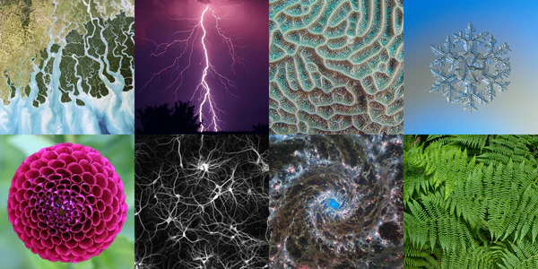
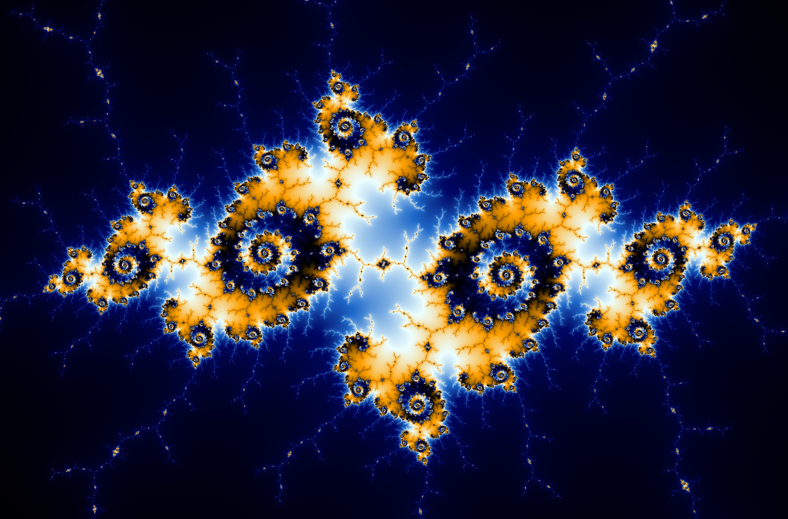

# fract-ol
This project is about creating graphically beautiful fractals.

https://github.com/Abdeljalil-Bouchfar/fract-ol/assets/55533328/c65ff3aa-a1e4-4226-b247-892932c8c20b

https://github.com/Abdeljalil-Bouchfar/fract-ol/assets/55533328/6572960d-8eb6-4758-ad8c-e5f2d67f07d0

## What are Fractals
  A fractal is a never-ending pattern that repeats itself at different scales, this property is called `self-similarity`, although fractals are very complex, they are made by repeating a simple operation driven by recursion.
## Fractals are everywhere
  In fact, nature is full of fractals. For instance trees, rivers, coastlines, mountains, clouds, seashells, hurricanes:
  
  
  
  And there is Abstract fractals – such as the Mandelbrot Set – can be generated by a computer calculating a simple equation over and over:

  

  ## Resources
[📑 imaginary-numbers](https://www.cuemath.com/numbers/imaginary-numbers/)

[📑 Complex-numbers](https://www.cuemath.com/numbers/complex-numbers/)

[📑 Mandelbrot](https://mathworld.wolfram.com/MandelbrotSet.html)
    
[📑 Julia](https://en.wikipedia.org/wiki/Julia_set)

[🎬 What's so special about the Mandelbrot Set?](https://www.youtube.com/watch?v=FFftmWSzgmk)

[🎬 The Mandelbrot Set](https://www.youtube.com/watch?v=NGMRB4O922I)

[🎬 Filled Julia Set](https://www.youtube.com/watch?v=oCkQ7WK7vuY)
